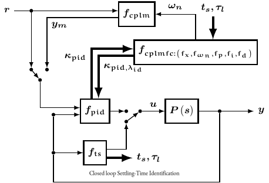

# Simplified Algorithm for a Modern Implementation of the PID Law
<!-- abstract, summary, tldr, info, todo, tip , hint, important, success, check, done, faq, help, question-->
<!-- warning, attention, failure, error, bug, missing, example, quote, cite-->

The PID law is still largely misunderstood. Some classify it as a simple and old control algorithm.
However, the PID law is the simplest representation of active inference in nature. It is the simplest representation of the complex intelligence of inference in nature. The PID law, actively tries to minimize the deviation of the sensed behaviour from the expected behaviour. It is a law for making inference based on an expected behaviour, and a sensed behaviour.

This means that the PID law is artificial intelligence (AI) for inference.
 Notably, Nicolai Minorsky realised this in the early nineties. It is clear that the representation of this AI is still far from mature.

In systems and control, this law is used as an algorithm for robust feedback control.
It infers the necessary control input $u$ to a dynamical system, to reach an achievable expected output $r$ of the dynamical system

Two main problems in this AI exist. The representation, and the design of AI. Research in the control literature has mostly focused on the latter.

!!!summary "Synopsis"
    In this library, we provide for practical use, a simple but robust realization of the PID law represented in critic form.
    The features implemented are compactly listed in the [about](about.md) page.
    The problem of automatic design of the PID law for control is approached from the viewpoint of the 'closed PID-loop model'.
    For a more technical understanding of this automatic tuning design, read the preprint at (https://arxiv.org/pdf/2006.00314).

Also, please see the [library license](license.md) for further details on library use.

## PID Law: Representation
The PID Law can be represented as a critic function: $u = f(r,y)$
$$
u=f(r,y)=\lambda_p\,u_p + \lambda_i\,u_i + \lambda_d\,u_d
$$

<!-- ## Tuning Usecase -->
<!--* `mkdocs new [dir-name]` - Create a new project.-->
<!--* `mkdocs serve` - Start the live-reloading docs server.-->
<!--* `mkdocs build` - Build the documentation site.-->
<!--* `mkdocs -h` - Print help message and exit.-->

## Usecase
The tuning method included in this library as default is the CPLMFC.
The process is illustrated as shown:



### Initializations

=== "C++"
``` c++
#include "Arduino.h"
/* PID Library Include Files */
#include "ModernPIDControlSS.h"

/* Global Declarations */
/* Tuning Parameters */
double wn;
float alpha;

/* Timing Information */
double L;
double ts;
double dt = 0.01;
double t = 0.0;

const double r = 150.0;
double y = 0;

int countseq = 0;

const int umin = -255;
const int umax = 255;
const int dead_max = 100;
const int dead_min = 10; // zero tolerance limits

/* Parameters PID Structure Config. */
PIDNet PIDobj_II(r, y, dt, umax, umin);

```


### Setup

=== "C++"
``` c++
void setup() {
    // Turn on Serial Comms.
    // 9600 baud is a compromise setting for easy killing of a runaway process
    // and very slow process
    Serial.begin(9600); // Can Go Up to 2M
    PIDobj_II.Ts = dt;
    /* Parameters PID Structure Config. */
    PIDobj_II.b = 1; // optional
    PIDobj_II.c = 0; // optional
    PIDobj_II.follow = 1; // optional
 
    
    /* CPLMFC Tuning HyperParameter Config. */
    int Nts = 228; // settling horizon: set after settling-time identification
    ts = Nts*d; // settling time (including delay time)
    L = 0*dt; // estimated transport or delay time
    /* Hyper-Parameter for Kp and Critic Weights */
    alpha = 20.0; //  for P
    // for D
    PIDobj_II.lambdad = 0.1;
    // I
    PIDobj_II.lambdai = 0.5;
    
    /* PID Commonsense Model Config. */
    /* Natural Frequency for PID Commonsense */
    tuneWn(PIDobj_II, ts, wn);
    //Serial.println(wn);// debug
}
```

### Settling-Time Identification Loop

=== "C++"
``` c++
        ...
        /* SYS ID- START */
        if (sys_id == 1) {
            if (countseq==0) {
                ref_id = 1*255;
                PIDobj_II.y = 1*255;
            }
            PIDobj_II.u = ref_id - PIDobj_II.y; // SYS ID- END
        }
        ...

```


### PID-Control Loop

=== "C++"
``` c++
    ...
    tstart = micros()/double(1000000);
    t = t - tstart;
    if (t >=( (PIDobj_II.T_prev+PIDobj_II.Ts)-(0.5*PIDobj_II.Ts) )) {

        /* CPLM Evolution */
        cplm_kernel(PIDobj_II.ym, PIDobj_II.xm, PIDobj_II.r,
               PIDobj_II.Ts, 0, 0, wn);
        // Serial.print("ym: "); Serial.println(PIDobj_II.ym);
        /* CPLMFC Tuning Computation */
        tuneKp(PIDobj_II, t, L, ts, alpha, 2);
        //Serial.print("Kp: ");Serial.println(PIDobj_II.Kp);

        tuneKi(PIDobj_II, wn);
        //Serial.print(" Ki: ");Serial.print(PIDobj_II.Ki);

        tuneKd(PIDobj_II, wn);
        //Serial.print(" Kd: ");Serial.println(PIDobj_II.Kd);

        /* PID Control State Evolution: Architecture */
        sfunPID_kernel(PIDobj_II, t);
        //Serial.print("upwm_II: "); Serial.println(PIDobj_II.u);
    }
    t = micros()/double(1000000);
    ...
```

## Notice
Please, this Guide is still a draft (beta). It will be updated gradually.

!!!faq
    Please, feel free to contact me at oasomefun@futa.edu.ng for any questions or to report any bug.

<!--    mkdocs.yml    # The configuration file.-->
<!--    docs/-->
<!--        index.md  # The documentation homepage.-->
<!--        ...       # Other markdown pages, images and other files.-->


